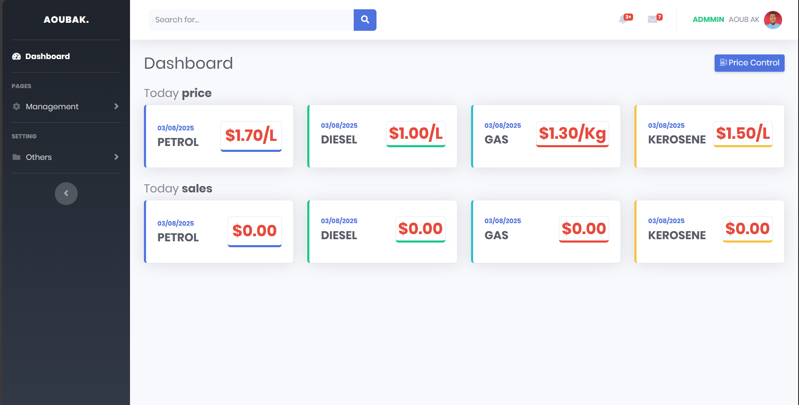

# Fuel Managment System - README
## 📌 Project Overview

The Fuel Station Management System is a web-based application designed to efficiently manage fuel stations by tracking fuel sales, inventory, transactions, employees, and suppliers. The system ensures accurate record-keeping, real-time fuel stock monitoring, and seamless transaction handling.

## 📂 Features

* Fuel Management – Track fuel types, stock levels, and deliveries.
* Sales Transactions – Process fuel purchases and maintain customer transaction history.
* Employee Management – Manage station staff and their roles.
* Customer Loyalty System – Reward frequent customers with loyalty points.
* Supplier Management – Record fuel deliveries and manage supplier details.
* Reports & Analytics – Generate sales, stock, and financial reports.

## 🛠️ Technologies Used
* Frontend: HTML, CSS, JavaScript (Bootstrap).
* Backend: PHP.
* Database: MySQL.
* Server: Apache.
* Other Tools: Git.

## 📌 Installation Guide

1️⃣ __Prerequisites__

Ensure you have the following installed:

* ✅ XAMPP (for PHP & MySQL) OR Python (for Flask)
* ✅ Node.js (if using React)
* ✅ Git (for version control)

2️⃣ **Clone the Repository**

git clone https://github.com/aoubak/fuel-station-management.git cd fuel-station-management

3️⃣ **Database Setup**

Run the following SQL script to create necessary tables:

CREATE DATABASE FuelStationDB;
USE FuelStationDB;

import SQL FILE in the project files into your MySql Server

## 🖥️ Usage Guide
* 1️⃣ Login as an Admin, Employee, or Manager.
* 2️⃣ Add Fuel Stock received from suppliers.
* 3️⃣ Process Transactions when customers purchase fuel.
* 4️⃣ Track Fuel Levels, Prices and generate reports.
* 5️⃣ Manage Employees and assign roles.

## 📌 Contributors
* 👤 Ayub Abdi Said (AOUBAK) - Developer & Maintainer
* 📧 Contact: aoubak01@gmail.com

